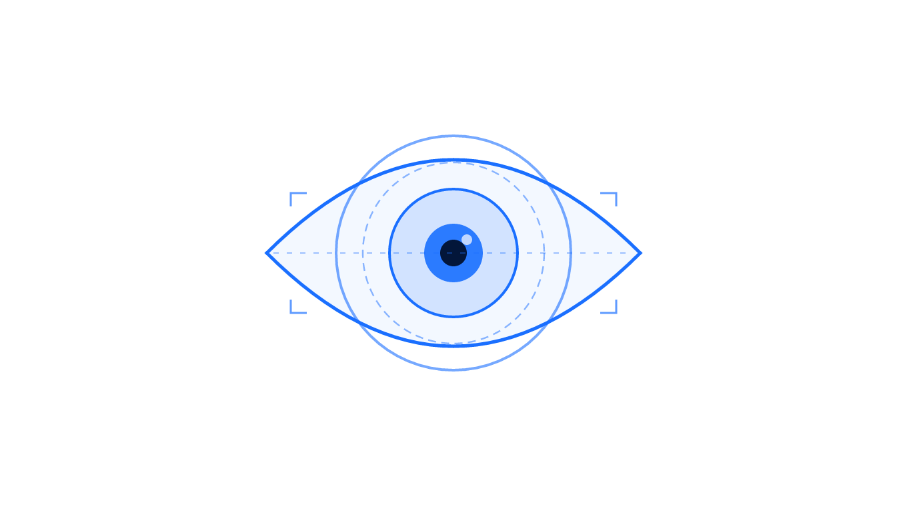
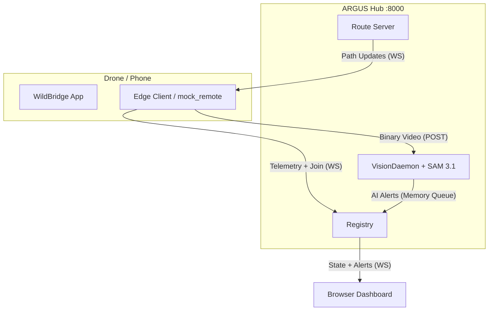

<div align="center">
  
</div>

> **ARGUS Hub — AI-Orchestrated Multi-Drone Swarm Command & Control**
> Edge-driven FastAPI hub with SAM 3.1 vision, Gemini image descriptions, live dashboard with 2D + 3D OSM maps, and hardened path following.
> Built atop the [WildBridge](https://portal.findresearcher.sdu.dk/en/publications/wildbridge-ground-station-interface-for-lightweight-multi-drone-c) DJI SDK V5 bridge (Rolland et al., RiTA 2025 — part of the EU Horizon Europe [WildDrone](https://wilddrone.eu) programme).

## Overview

**ARGUS Hub** (`GroundStation/WebServer/`) is the control plane: a FastAPI server that drones join themselves over WebSockets, runs centralized AI inference on every pushed video frame, and surfaces detections + live telemetry to a single-page dashboard. The hub is entirely in-memory — nothing persists across restarts, no registry file, no pre-configuration.

The **WildBridge Android app** (`WildBridgeApp/`) is the edge component: installed on a DJI RC controller, it exposes the aircraft's telemetry and control surfaces over HTTP/TCP/RTSP on the local network. The ARGUS edge client (`GroundStation/client/aegis_client.py`) bridges WildBridge's RC-side contract to the hub's WebSocket contract. The hub treats a simulated drone (`mock_remote.py`) and a real RC identically.

## Research and Citation

Based on the WildBridge platform, funded by the European Union's Horizon Europe Research Program (Grant Agreement No. 101071224) and the EPSRC-funded *Autonomous Drones for Nature Conservation Missions* grant (EP/X029077/1).

```bibtex
@inproceedings{Rolland2025WildBridge,
  author    = {Edouard Rolland and Kilian Meier and Murat Bronz and Aditya Shrikhande and Tom Richardson and Ulrik Pagh Schultz Lundquist and Anders Christensen},
  title     = {WildBridge: Ground Station Interface for Lightweight Multi-Drone Control and Telemetry on DJI Platforms},
  booktitle = {Proceedings of the 13th International Conference on Robot Intelligence Technology and Applications (RiTA 2025)},
  year      = {2025},
  month = {December},
  publisher = {Springer},
  address   = {London, United Kingdom},
  note      = {In press},
  url       = {https://portal.findresearcher.sdu.dk/en/publications/wildbridge-ground-station-interface-for-lightweight-multi-drone-c},
}
```

## What's New (tip of `main` — commit `b322c68`, 2026-04-19)

- **Swarm spawns at 100 m reach** per drone with a debounced path broadcast (1.5 s trailing edge) and equality-gated sends — rapid join/disconnect churn no longer spams drones with superseded waypoints. (`GroundStation/WebServer/app/routes.py`)
- **3D dashboard** with MapLibre + OpenFreeMap, drones + paths floating at altitude (`static/dashboard.html`).
- **Gemini image description** integration with subject-only prompt + cached responses (`app/gemini.py`, `app/config.py`, `.env`).
- **Light / dark theme toggle** on the dashboard with `localStorage` persistence.
- **Mini-3-Pro flight hardening** — pure-pursuit lookahead restored, reversal debounced (`GroundStation/client/aegis_client.py`).
- **Mid-flight re-allocation guard** via `mission_state` from the edge client.

## Feature Summary

### AI Vision & Understanding
- **SAM 3.1 centralized vision.** A single `VisionDaemon` holds the SAM 3.1 model in VRAM and round-robins inference across every connected drone's most-recent video frame against a swarm-wide natural-language prompt. On a hit it captures TWO JPEGs at the same instant — the annotated frame (with SAM mask + bounding box overlaid) for operator viewing, and the un-annotated raw frame for downstream processing.
- **Gemini image descriptions.** Every detection gains an opt-in **Description** checkbox in the dashboard. On demand, the raw frame is POSTed to `gemini-flash-latest` with a *subject-only* prompt — Gemini describes just the detected object (e.g. *"Silver metallic travel mug with matte finish and a black lid"*) and returns a 0-100 confidence score. Results are cached both server- and client-side so each detection costs at most one Gemini round-trip. Missing/invalid API key degrades gracefully to a fallback response; there are no 500s.

### Dashboard
- **Single-page, no build step.** Inline HTML + CSS + JS in `static/dashboard.html`. Talks to `/api/drones`, `/api/detections`, `/api/prompt`, and `/ws/drones`.
- **Light / dark theme.** Neutral off-white palette with dark-gray text in light mode; glassmorphic dark palette in dark mode. Applied before first paint via a tiny inline head script (no FOUC). Persisted in `localStorage`; falls back to `prefers-color-scheme`.
- **2D map (Leaflet + CARTO).** Live drone markers with permanent labels, auto-pinned detection hits with hover-preview thumbnails, and dashed path polylines per drone (colored to match the drone marker).
- **3D map (MapLibre GL JS + OpenFreeMap).** Toggle-able view with extruded OSM building geometry. Drones render as floating colored discs at 100 m altitude; each drone's planned path renders as a thin colored ribbon at the same altitude so the operator can watch the drone track its sweep through the sky. No API key; OpenFreeMap vector tiles are free.
- **Detection tray + full-panel view.** Compact list with toast notifications on *live* hits; `⛶` opens a full card grid (each card: annotated JPEG, Pin-to-Map checkbox, Description checkbox, GPS coords).
- **Fullscreen lightbox.** Shared for both detection frames and live MJPEG streams. Clicking a detection shows the annotated frame with the Description checkbox; clicking a drone tile shows the live feed. Closing the lightbox releases the MJPEG stream.

### Edge Stack & Path Following
- **Edge-driven registration.** Drones join via `WS /ws/swarm/{uuid}` and push telemetry + video themselves — no server-side RTSP polling, no pre-registration.
- **Server-side swarm pathing.** The hub allocates non-overlapping zigzag/sweep sectors to every drone on join or disconnect using a grid-based exclusive-owner allocator (`app/pathing.py`, reach 100 m per drone, 10 m stripe spacing, 20 m cells).
- **Debounced path broadcasts.** Path updates are trailing-edge debounced by 1.5 s so rapid join/disconnect churn doesn't spam drones with superseded routes. Equality-gated: a drone only receives a new path message if the waypoint list actually changed.
- **Mid-flight re-allocation guard.** Drones that have announced `mission_state: active` are skipped during re-allocation, preventing an in-flight path from being yanked when a second drone joins.
- **Pure-pursuit lookahead fix (Python-side).** A long-standing positional-argument collision between the Python edge client and the unchanged Android `DroneController.navigateTrajectory` was making `lookaheadDistance` resolve to 0, which degenerated pure pursuit into aim-at-own-projection and caused perpendicular oscillation across patrol lines. The edge client now pins the 4th CSV field (which binds positionally to `lookaheadDistance` on the drone side) to 5.5 m — restoring smooth tracking without any APK rebuild.
- **Reversal state machine.** On patrol endpoints, the edge client only reverses when within 5 m *and* has dwelled there ≥ 4 s *and* the last reversal was ≥ 10 s ago. Tuned to absorb ±2-4 m GPS noise on a Mini 3 Pro without false-triggering.

### Other
- **Real-time telemetry.** 20 Hz edge-side sampling, 1 Hz dashboard fan-out via `WS /ws/drones`.
- **Live MJPEG video.** One tile per drone in the sidebar grid; any tile opens full-screen in the shared lightbox.
- **Tested with simulated multi-drone fleets.** Sub-100 ms command latency inside the edge stack, 6 concurrent video streams before degradation.
- **Cross-platform**: Python / ROS 2 / Android / browser. Backend is FastAPI + uvicorn; Android app uses DJI MSDK V5; ROS 2 Humble wrapper in `GroundStation/ROS/`.

## Supported Hardware

### DJI Drones (Mobile SDK V5 Compatible)
- **DJI Mini 3/Mini 3 Pro**
- **DJI Mini 4 Pro**
- **DJI Mavic 3 Enterprise Series**
- **DJI Matrice 30 Series (M30/M30T)**
- **DJI Matrice 300 RTK**
- **DJI Matrice 350 RTK**
- Full list [here](https://developer.dji.com/doc/mobile-sdk-tutorial/en/)

### Remote Controllers
- **DJI RC Pro** - Primary supported controller
- **DJI RC Plus** - Enterprise compatibility
- **DJI RC-N3** - Standard controller (tested with smartphones)

## Performance Characteristics

Based on controlled experiments with consumer-grade hardware:

### Telemetry Performance
- **Latency**: <113ms mean, <290ms 90th percentile (up to 10 drones at 32Hz)
- **Scalability**: Tested up to 10 concurrent drones

### Video Streaming Performance
- **Latency**: 1.4-1.6s (1-4 drones), 1.8-1.9s (5-6 drones)
- **Scalability Limit**: 6 concurrent video streams before degradation
- **Format**: Standard Definition via RTSP
- **Compatibility**: FFmpeg, OpenCV, VLC

## Quick Start

### Prerequisites
- DJI drone + compatible RC (see [Supported Hardware](#supported-hardware)) **or** a ground-station computer alone for simulation.
- Local Wi-Fi network, 5 GHz recommended. The RC and the ground-station must share the subnet — no NAT.
- Python 3.11+ and, optionally, a CUDA GPU for SAM 3.1 (CPU works but each frame is seconds, not milliseconds).

### Real-drone deployment — WildBridge app on the RC

The Android app sits on the DJI RC and exposes the drone's telemetry and control endpoints on the LAN. **You only need this for real flights; simulation below skips it entirely.**

1. Open `WildBridgeApp/android-sdk-v5-as/` in **Android Studio Koala 2024.1.1**.
2. Put your [DJI developer](https://developer.dji.com/) API key in `local.properties` (**no quotes**):
   ```
   AIRCRAFT_API_KEY=your-key-here
   ```
3. Build (generate the keystore from `gradle.properties` if prompted: `msdkkeystore.jks`, password `123456`, alias `msdkkeystore`) and deploy to the RC or an Android phone over USB.
4. On the RC, open WildBridge → Testing Tools → **Virtual Stick**. The HTTP/TCP/RTSP servers are live only while this page is foregrounded.

### Basic Usage

#### 1. Remote Controller Setup
- Connect RC to local Wi-Fi network
- Note the RC's IP address from network settings
- Install and launch WildBridge app
- Navigate to "Testing Tools" -> "Virtual Stick"
- When using control commands, press "Enable Virtual Stick"

#### 2. Ground Station Connection

**Telemetry Access via TCP Socket** (Python):
```python
import socket
import json

rc_ip = "192.168.1.100"  # Your RC IP
sock = socket.socket(socket.AF_INET, socket.SOCK_STREAM)
sock.connect((rc_ip, 8081))

buffer = ""
while True:
    data = sock.recv(4096).decode('utf-8')
    buffer += data
    while '\n' in buffer:
        line, buffer = buffer.split('\n', 1)
        if line.strip():
            telemetry = json.loads(line)
            print(f"Battery: {telemetry['batteryLevel']}%")
            print(f"Location: {telemetry['location']}")
```

**Video Streaming** (OpenCV):
```python
import cv2

rc_ip = "192.168.1.100"  # Your RC IP
rtsp_url = f"rtsp://aaa:aaa@{rc_ip}:8554/streaming/live/1"
cap = cv2.VideoCapture(rtsp_url)
ret, frame = cap.read()
```

**Control Commands** (HTTP POST):
```python
import requests

rc_ip = "192.168.1.100"  # Your RC IP
# Takeoff
requests.post(f"http://{rc_ip}:8080/send/takeoff")

# Navigate to waypoint with PID control
data = "49.306254,4.593728,20,90"  # lat,lon,alt,yaw
requests.post(f"http://{rc_ip}:8080/send/gotoWPwithPID", data=data)

# DJI Native waypoint mission
waypoints = "49.306,4.593,20; 49.307,4.594,25; 49.308,4.595,20"
requests.post(f"http://{rc_ip}:8080/send/navigateTrajectoryDJINative", data=waypoints)
```

## Web Ground Station (ARGUS Hub)

The **ARGUS Hub** (`GroundStation/WebServer/`) is a unified FastAPI-based command-and-control center for operating drone swarms. It replaces manual fleet management with an **Edge-Driven** paradigm where drones discover and join the Hub automatically.

### Central Pillars
1. **The Modern Dashboard (`/`)**: 
   - A glassmorphic monitoring interface with a live Leaflet map and dynamic video grid.
   - **Real-time Pathing**: The Hub automatically assigns non-overlapping zigzag/sweep patterns to every drone that joins.
   - **Detections Tray**: AI-detected objects appear instantly as notifications with time-stamps and drone IDs.
2. **SAM 3.1 AI Vision (`VisionDaemon`)**:
   - The hub runs a background inference loop that multiplexes incoming video frames through the SAM 3.1 model.
   - Operators can dispatch a "Master Prompt" (e.g., "blue truck" or "person in red jacket") to the entire swarm via the dashboard.
3. **Edge Connectivity**: 
   - Drones connect via `ws://{HUB_IP}:8000/ws/swarm/{uuid}`.
   - Binary video frames are pushed via POST to the Hub's ingest endpoint, while telemetry flows over the persistent socket.

### System Architecture



### Installation & Startup

#### 1. Setup Environment
```bash
cd GroundStation/WebServer
python -m venv .venv
.\.venv\Scripts\Activate.ps1   # Windows PowerShell (bash: source .venv/bin/activate)
pip install -r requirements.txt
```
*Note: a CUDA GPU is strongly recommended for SAM 3.1. `--cpu` works for dev but runs seconds per frame.*

#### 1b. Gemini API key (optional, enables the "Description" feature)
Get a key at [Google AI Studio](https://aistudio.google.com/apikey) and drop it into a new `.env` file **inside `GroundStation/WebServer/`**:

```bash
echo 'GEMINI_API_KEY=YOUR_KEY_HERE' > GroundStation/WebServer/.env
# Optional — override the model; default is gemini-flash-latest:
# echo 'GEMINI_MODEL=gemini-2.5-flash' >> GroundStation/WebServer/.env
```

`.env` is gitignored (`*.env` in the repo root `.gitignore`). Without a key the hub still boots — the Description checkbox returns a graceful fallback (`"(description unavailable)"`, confidence 0) instead of 500-ing.

#### 2. Run the Hub
```bash
python -m app
```
*Flags:*
- `--host HOST` / `--port PORT` — bind address (default `127.0.0.1:8000`).
- `--test` — small 5×5 m patrol paths at 10 m altitude for flight simulations.
- `--cpu` — force SAM onto CPU instead of CUDA GPU 0.

The hub is entirely in-memory; there's no registry file and drones don't need pre-registering. Any running edge client will auto-join.

#### 3. Simulated Multi-Drone Testing
The architecture is edge-driven — drones *push* telemetry and video to the hub — so each simulated drone needs three processes. For one drone:

```bash
# Terminal 1 — the hub
python -m app

# Terminal 2 — fake a DJI RC locally on ports 8082/8083
python client/mock_remote.py --port-http 8082 --port-tcp 8083 --lat 46.0569 --lng 14.5058

# Terminal 3 — the edge agent that bridges the fake RC ↔ hub
python client/aegis_client.py --ip 127.0.0.1 --port-http 8082 --port-tcp 8083
```

For a second simulated drone, run a second `mock_remote.py` on different ports (e.g. `--port-http 8084 --port-tcp 8085 --lat ...`) and a second `aegis_client.py` pointed at it. Each mock grabs the local webcam for video; pass `--image-folder <dir>` on subsequent mocks to sidestep the camera-device lock.

### Dashboard Endpoints

| Method | Path | Purpose |
|---|---|---|
| GET | `/` | Single-page swarm dashboard (map, live camera tiles, detection panel, lightbox, toasts) |
| GET | `/api/health` | Hub liveness + active-drone count |
| GET | `/api/drones` | All drone telemetry snapshots |
| POST | `/api/prompt` | `{prompt}` — set the master SAM 3.1 tracking prompt |
| GET | `/api/detections` | All detection metadata (append-only history, cap 1000). Each entry carries `has_image`, `has_raw_image`, and — once Gemini has been queried — `description` + `confidence` |
| GET | `/api/detections/{id}/image.jpg` | SAM-overlaid JPEG for the detection; 404 once evicted (latest 50 retained) |
| GET | `/api/detections/{id}/raw_image.jpg` | Un-annotated JPEG captured at the same instant as the overlaid frame. Same 50-entry FIFO, same 404-on-eviction. The Description feature feeds this image to Gemini |
| POST | `/api/detections/{id}/describe` | On first call: POSTs the raw JPEG + the SAM prompt to `gemini-flash-latest` with a subject-only prompt template, parses `CONFIDENCE: NN`, and caches the result. Returns `{description, confidence, cached}`. Subsequent calls for the same detection hit the cache |
| WS | `/ws/drones` | 1 Hz fan-out of telemetry snapshots + new-detection alerts to the dashboard |
| WS | `/ws/swarm/{uuid}` | Edge-client bidirectional channel: join, telemetry, path updates |
| POST | `/api/swarm/{uuid}/video` | Edge-client raw JPEG ingest |
| GET | `/api/swarm/{uuid}/video.mjpg` | Dashboard-facing MJPEG re-stream for tile grid + fullscreen lightbox |

---

### Safety & Overrides
- **Controller Dominance**: Physical RC inputs always override Virtual Stick commands sent by the Hub.
- **RTH Priority**: The Hub is designed to maintain paths relative to the **original ascent point** to ensure drones stay within reliable radio range of their respective operators.
- **Deadman Switch**: The Hub automatically sends hover/neutral commands if an edge connection is lost during flight.


### RTSP smoke test (without the webapp)

`GroundStation/WebServer/tools/check_video.py` verifies the video path end-to-end — opens RTSP, prints reported resolution/FPS, measures actual received FPS, and saves the first decoded frame to `first_frame.png`:

```bash
pip install opencv-python   # if not already installed in the venv
python tools/check_video.py 192.168.1.137
```

### Safety and operational notes

- **Always click "Enable Virtual Stick" first.** The RC ignores `/send/stick` until virtual-stick mode is active.
- **The DISABLE / HARD STOP button** triggers `/send/abortMission` — it's the in-UI kill switch.
- **Deadman:** if the WebSocket closes or falls silent for 500 ms while sticks are non-zero, the backend automatically forwards a zeroed stick command.
- **The physical RC always overrides the webapp** — grab the physical sticks or the RTH button on the RC if anything feels wrong.
- **No auth.** The RC's own HTTP server has no auth either — run on a trusted LAN only.
- **Don't let the phone app background** while flying. Ports 8080 / 8081 / 8554 only exist while the Virtual Stick page is foregrounded. Disable battery-save for the app and keep the screen awake.

## API Reference

### Telemetry Stream (TCP Socket - Port 8081)

Connect to the TCP socket on port 8081 to receive continuous JSON telemetry at 20Hz.

**Telemetry Fields:**
| Field | Description |
|-------|-------------|
| `speed` | Aircraft velocity (x, y, z) |
| `heading` | Compass heading in degrees |
| `attitude` | Pitch, roll, yaw values |
| `location` | GPS coordinates and altitude |
| `gimbalAttitude` | Gimbal orientation |
| `batteryLevel` | Battery percentage |
| `satelliteCount` | GPS satellite count |
| `homeLocation` | Home point coordinates |
| `distanceToHome` | Distance to home in meters |
| `waypointReached` | Waypoint status flag |
| `isRecording` | Camera recording status |
| `flightMode` | Current flight mode (GPS, MANUAL, GO_HOME, etc.) |
| `remainingFlightTime` | Estimated flight time remaining |
| `batteryNeededToGoHome` | Battery % needed for RTH |
| `batteryNeededToLand` | Battery % needed to land |
| `timeNeededToGoHome` | Time to return home (seconds) |
| `maxRadiusCanFlyAndGoHome` | Max flyable radius (meters) |

### Control Endpoints (HTTP POST - Port 8080)

| Endpoint | Description | Parameters |
|----------|-------------|------------|
| `/send/takeoff` | Initiate takeoff | None |
| `/send/land` | Initiate landing | None |
| `/send/RTH` | Return to home | None |
| `/send/gotoWP` | Navigate to waypoint | `lat,lon,alt` |
| `/send/gotoWPwithPID` | Navigate with PID control | `lat,lon,alt,yaw` |
| `/send/gotoYaw` | Rotate to heading | `yaw_angle` |
| `/send/gotoAltitude` | Change altitude | `altitude` |
| `/send/navigateTrajectory` | Follow trajectory (Virtual Stick) | `lat,lon,alt;...;lat,lon,alt,yaw` |
| `/send/navigateTrajectoryDJINative` | DJI native waypoint mission | `lat,lon,alt;lat,lon,alt;...` |
| `/send/abort/DJIMission` | Stop DJI native mission | None |
| `/send/abortMission` | Stop and disable Virtual Stick | None |
| `/send/enableVirtualStick` | Enable Virtual Stick mode | None |
| `/send/stick` | Virtual stick input | `leftX,leftY,rightX,rightY` |
| `/send/camera/zoom` | Camera zoom control | `zoom_ratio` |
| `/send/camera/startRecording` | Start video recording | None |
| `/send/camera/stopRecording` | Stop video recording | None |
| `/send/gimbal/pitch` | Gimbal pitch control | `roll,pitch,yaw` |
| `/send/gimbal/yaw` | Gimbal yaw control | `roll,pitch,yaw` |

### Status Endpoints (HTTP GET - Port 8080)

| Endpoint | Description |
|----------|-------------|
| `/status/waypointReached` | Check if waypoint reached |
| `/status/intermediaryWaypointReached` | Check intermediary waypoint |
| `/status/yawReached` | Check if target yaw reached |
| `/status/altitudeReached` | Check if target altitude reached |
| `/status/camera/isRecording` | Check recording status |

### Legacy Telemetry Endpoints (HTTP GET - Port 8080)

These endpoints are available for backward compatibility. For continuous telemetry, use the TCP socket on port 8081.

| Endpoint | Description |
|----------|-------------|
| `/` | Connection test |
| `/aircraft/allStates` | Complete telemetry package (JSON) |
| `/aircraft/speed` | Aircraft velocity |
| `/aircraft/heading` | Compass heading |
| `/aircraft/attitude` | Pitch, roll, yaw |
| `/aircraft/location` | GPS coordinates and altitude |
| `/aircraft/gimbalAttitude` | Gimbal orientation |
| `/home/location` | Home point coordinates |

### Video Streaming
- **RTSP URL**: `rtsp://aaa:aaa@{RC_IP}:8554/streaming/live/1`
- **Format**: H.264, Standard Definition
- **Latency**: 1.4-1.9 seconds (depending on network)

## Project Structure

```
WildBridge/
├── GroundStation/                      # Ground Control System (GS)
│   ├── Python/                         # Python GS
│   │   └── djiInterface.py             # Full DJI communication API
│   └── ROS/                            # ROS 2 integration
│       ├── dji_controller/             # Main drone control package
│       ├── drone_videofeed/            # RTSP video streaming package
│       └── wildview_bringup/           # Launch configuration
└── WildBridgeApp/                      # Android application
    ├── android-sdk-v5-as/              # Main app project
    ├── android-sdk-v5-sample/          # Sample implementations
    └── android-sdk-v5-uxsdk/           # UI components
```

### ROS 2 Integration

WildBridge includes a complete ROS 2 implementation developed using **ROS Humble**, demonstrating how WildBridge HTTP requests can be seamlessly integrated into robotics applications.

#### Features
- **Multi-drone Support**: Simultaneous control of multiple DJI drones
- **Real-time Telemetry**: Publishing drone states as ROS topics
- **RTSP Video Streaming**: Live video feed integration with ROS Image messages
- **Command Interface**: ROS service calls for drone control
- **Dynamic Discovery**: Automatic drone detection via MAC address lookup

#### Package Structure
```
GroundStation/ROS/
├── dji_controller/          # Main drone control package
│   ├── controller.py        # ROS node for drone commands and telemetry
│   └── dji_interface.py     # HTTP interface wrapper
├── drone_videofeed/         # RTSP video streaming package
│   └── rtsp.py             # Video feed ROS node
└── wildview_bringup/        # Launch configuration
    └── swarm_connection.launch.py  # Multi-drone launch file
```

#### ROS Topics

**Published Topics** (per drone):
- `/drone_N/speed` - Current velocity magnitude
- `/drone_N/location` - GPS coordinates (NavSatFix)
- `/drone_N/attitude` - Pitch, roll, yaw
- `/drone_N/battery_level` - Battery percentage
- `/drone_N/video_frames` - Live camera feed (Image)

**Subscribed Topics** (commands):
- `/drone_N/command/takeoff` - Takeoff command
- `/drone_N/command/goto_waypoint` - Navigate to coordinates
- `/drone_N/command/gimbal_pitch` - Gimbal control

#### Usage Example
```bash
# Launch multi-drone system
ros2 launch wildview_bringup swarm_connection.launch.py

# Send takeoff command
ros2 topic pub /drone_1/command/takeoff std_msgs/Empty

# Navigate to waypoint [lat, lon, alt, yaw]
ros2 topic pub /drone_1/command/goto_waypoint std_msgs/Float64MultiArray "{data: [49.306254, 4.593728, 20.0, 90.0]}"

# Monitor telemetry
ros2 topic echo /drone_1/location
```

This ROS2 implementation showcases how WildBridge's HTTP API can be wrapped for integration with existing robotics frameworks, enabling seamless multi-drone coordination in research applications.

## Scientific Applications

WildBridge has been validated in multiple research domains:

- **Wildlife Conservation**: Real-time animal detection and geolocation
- **Wildfire Detection**: Early fire detection and mapping
- **Atmospheric Research**: Wind field profiling and measurement
- **Multi-drone Coordination**: Swarm-based data collection
- **Conservation Monitoring**: Long-term ecosystem studies

## Limitations and Considerations

### Technical Limitations
- **Video Scalability**: Maximum 6 concurrent video streams
- **Telemetry Rate**: Optimal performance up to 32Hz request rate
- **Synchronization**: Video and telemetry streams are not synchronized
- **SDK Dependency**: Relies on DJI Mobile SDK V5 evolution

### Operational Considerations
- **Setup Time**: Multi-drone configurations require network setup
- **Environmental Factors**: Performance affected by Wi-Fi interference
- **Data Synchronization**: Post-mission data alignment requires planning

## Troubleshooting

### Common Issues

**Connection Problems**:
- Verify RC IP address in network settings
- Ensure WildBridge app is running (Virtual Stick page open)
- For telemetry: connect to TCP port 8081
- For commands: use HTTP POST to port 8080

**Video Stream Issues**:
- Test RTSP URL in VLC: `rtsp://aaa:aaa@{RC_IP}:8554/streaming/live/1` (Open Network Protocol, Ctrl+N)
- Check network bandwidth for multiple streams
- Verify firewall settings on ground station

**Waypoint Navigation Issues**:
- If you send a drone to a waypoint but it does not move, ensure that Virtual Stick is enabled. You can enable Virtual Stick in the DJI App or send a command to enable it. Once enabled, the drone should be able to move to the waypoint.

### Debug Commands
```bash
# Test connectivity
ping {RC_IP}

# Test video stream
vlc rtsp://aaa:aaa@{RC_IP}:8554/streaming/live/1

# Monitor telemetry (TCP stream)
nc {RC_IP} 8081

# Check waypoint status
curl http://{RC_IP}:8080/status/waypointReached

# Send takeoff command
curl -X POST http://{RC_IP}:8080/send/takeoff
```

## License

This project is licensed under the MIT License - see the [LICENSE.txt](LICENSE.txt) file for details.

## Contributing

Contributions are welcome! Please reach out!

1. **Bug Reports**: Use GitHub issues with reproduction steps
2. **Feature Requests**: Describe use case and scientific application

For questions or collaboration inquiries, please contact the WildDrone consortium at [https://wilddrone.eu](https://wilddrone.eu).
